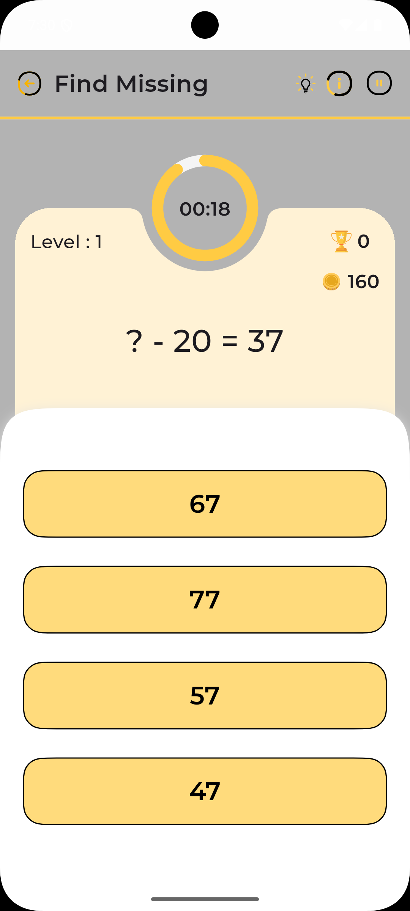
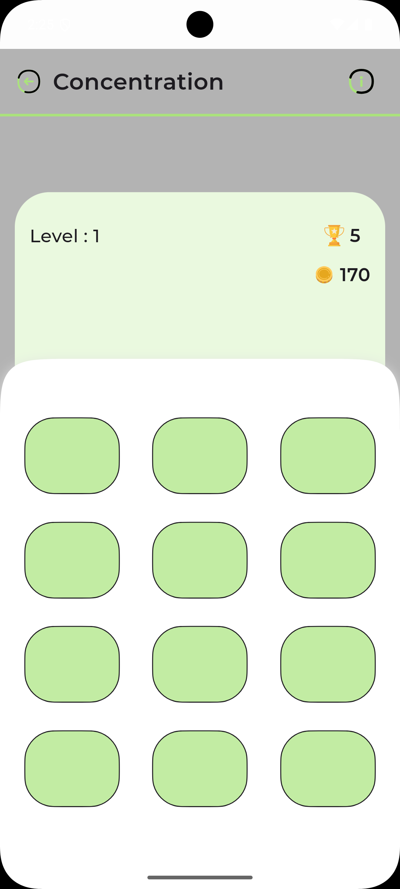
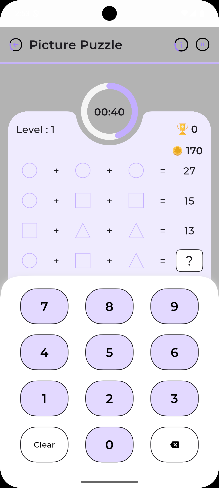
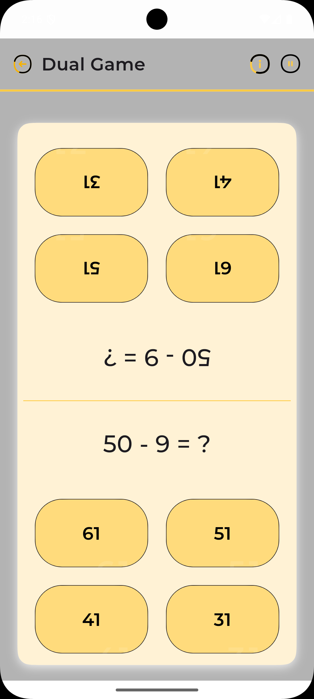
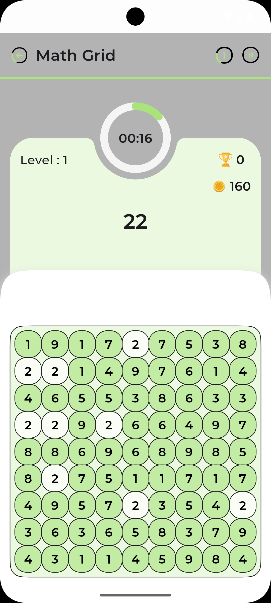
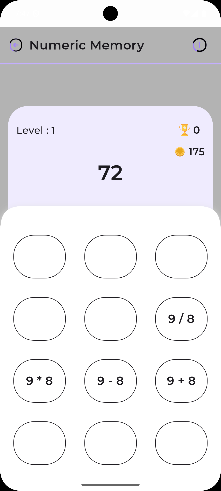

# Memory Math - Educational Math Game

Memory Math is a specially designed educational Flutter application that creates an inclusive learning environment for students with dyslexia and those experiencing early-onset dementia. The app combines evidence-based learning approaches with adaptive technology to make mathematics accessible and enjoyable for all learners.

## Specialized Learning Features

### Adaptive Game Modes

1. **Find Missing Numbers**
   - Dyslexia-friendly number presentation with OpenDyslexic font
   - High-contrast, customizable visual displays
   - Multi-sensory learning approach with audio support
   - Adjustable pace for processing needs
   - Step-by-step problem solving with visual guides
   

2. **Quick Math**
   - Flexible timing to accommodate different processing speeds
   - Clear, uncluttered interface with consistent layouts
   - Multi-modal input options (touch, voice, keyboard)
   - Confidence-building progression system
   - Short, focused practice sessions
   

3. **Math Memory**
   - Pattern-based learning for enhanced retention
   - Visual and spatial memory exercises
   - Cognitive skill reinforcement
   - Social interaction through multiplayer modes
   - Success-oriented gameplay design
  


### Accessibility Features

- **Dyslexia Support**
  - OpenDyslexic font option
  - Adjustable text sizing and spacing
  - Color overlay options
  - Text-to-speech functionality
  - Visual pattern recognition tools

- **Cognitive Support**
  - Clear, consistent navigation
  - Step-by-step instructions
  - Regular skill reinforcement
  - Memory-friendly interface
  - Progress tracking for caregivers

### Core Features

- **Multi-language Support**
  - English (Default)
  - Additional languages through localization
  - Easy language switching

- **Theme Support**
  - Light and Dark themes
  - System theme integration
  - Custom color schemes

- **Progress Tracking**
  - Achievement system
  - Progress persistence

- **Audio Feedback**
  - Sound effects for interactions
  - Background music options
  - Mute functionality

## Technical Details

### Key Libraries and Dependencies

### Platform Support

- iOS (12.0+)
- Android (API 21+)
- Windows
- Linux
- macOS

### Architecture

- **State Management**: Provider pattern
- **Dependency Injection**: GetIt service locator
- **Local Storage**: SharedPreferences
- **Design Pattern**: MVVM (Model-View-ViewModel)

## Getting Started

### Prerequisites

- Flutter SDK (Latest stable version)
- Dart SDK
- Android Studio / VS Code
- iOS development setup (for iOS builds)

### Installation

1. Clone the repository:

```bash
git clone https://github.com/yourusername/memory_math.git
```

2. Install dependencies:

```bash
flutter pub get
```

3. Run the application:

```bash
flutter run
```

### Building for Production

#### Android

```bash
flutter build apk --release
```

#### iOS

```bash
flutter build ios --release
```

#### Desktop Platforms

```bash
flutter build windows
flutter build linux
flutter build macos
```

## Development

### Project Structure
```
lib/
├── src/
│   ├── core/          # Core utilities and constants
│   ├── data/          # Data models and repositories
│   ├── ui/            # UI components and screens
│   └── utility/       # Helper functions and utilities
├── generated/         # Generated localization files
└── main.dart         # Application entry point
```

### Contributing

1. Fork the repository
2. Create your feature branch (`git checkout -b feature/AmazingFeature`)
3. Commit your changes (`git commit -m 'Add some AmazingFeature'`)
4. Push to the branch (`git push origin feature/AmazingFeature`)
5. Open a Pull Request


## Acknowledgments

- Flutter team for the amazing framework
- Contributors and maintainers
- Educational mathematics resources and inspiration

## Support

For support, email mule.nikhil@gmail.com or create an issue in the repository.
## Screenshots









## Architecture Details

### Clean Architecture Implementation

The application follows Clean Architecture principles, organized in layers:

1. **Domain Layer**
   - Contains business logic and entities
   - Pure Dart code with no dependencies
   - Use cases define application-specific business rules
   - Repository interfaces define data contracts

2. **Data Layer**
   - Implements repository interfaces
   - Handles data sources (local storage, API)
   - Data mapping and transformation
   - Cache management

3. **Presentation Layer**
   - UI components and screens
   - ViewModels handle UI logic
   - State management using Provider
   - Platform-specific implementations

### Code Organization

```
lib/
├── domain/
│   ├── entities/      # Business objects
│   ├── repositories/  # Repository interfaces
│   └── usecases/      # Business logic
├── data/
│   ├── repositories/  # Repository implementations
│   ├── datasources/   # Data source implementations
│   └── models/        # Data transfer objects
├── presentation/
│   ├── screens/       # UI screens
│   ├── widgets/       # Reusable components
│   └── viewmodels/    # Screen-specific logic
└── core/
    ├── constants/     # App-wide constants
    ├── themes/        # Theme configurations
    └── utils/         # Helper functions
```


**Accessibility Features for Dyslexic Users**

### Visual Design Accommodations

**Text and Typography:**
- **Font Choices:**
  - OpenDyslexic as default font option
  - Comic Sans MS alternative
  - Customizable font size (14pt - 24pt)
  - Adjustable letter spacing (1.35 default)
  - Customizable line height (1.5 default)

- **Color Management:**
  - High contrast color schemes
  - Customizable background colors
  - Pastel color options to reduce visual stress
  - Option to use colored overlays
  - Ability to adjust text-background contrast ratios

**Layout and Organization:**
- **Screen Structure:**
  - Clear visual hierarchy
  - Consistent element positioning
  - Ample white space
  - Limited items per screen
  - Grid-based alignments

- **Navigation:**
  - Clear, icon-based menus
  - Breadcrumb navigation trails
  - Step-by-step progression
  - Visual progress indicators
  - Simplified menu structures


### Personalization Options

**User Profiles:**
- Individual setting preferences
- Progress tracking
- Difficulty level management
- Custom color schemes


**Adaptive Learning:**
- Dynamic difficulty adjustment
- Strength-based progression

### Support Features

**Help System:**
- Context-sensitive help
- Simplified instructions

**Feedback Mechanisms:**
- Immediate response validation
- Positive reinforcement
- Progress celebrations
- Achievement system


## Educational Benefits

### For Dyslexic Learners
- Enhanced number recognition
- Reduced visual stress
- Improved mathematical confidence
- Personalized learning pace
- Multi-sensory engagement

### For Dementia Support
- Cognitive function maintenance
- Memory exercise through repetition
- Social engagement opportunities
- Structured learning routines
- Achievement-based motivation

