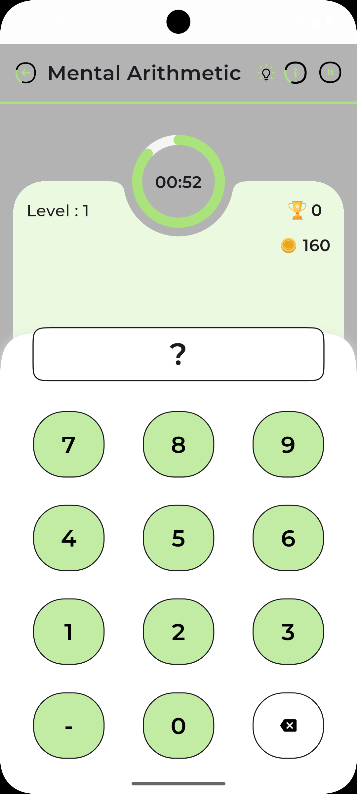
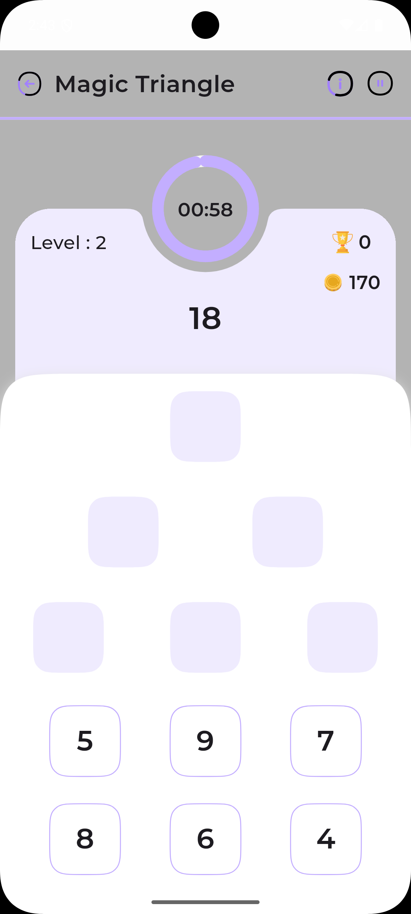
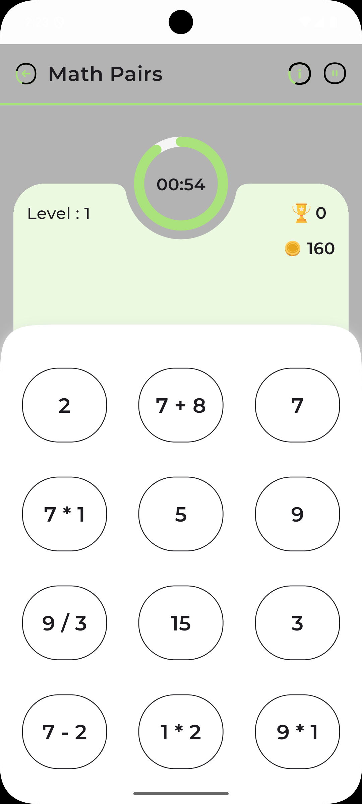

# Memory Maths - Accessible Educational Math Application

An innovative Flutter-based educational application designed specifically for inclusive mathematics learning, with specialized support for users with dyslexia and early-onset dementia. The application combines adaptive difficulty algorithms with accessibility-first design principles to create an engaging and supportive learning environment.

## 🎯 Core Mission

MathsGames bridges the gap in mathematical education by providing:
- **Accessibility-First Design**: Built with dyslexic-friendly themes and cognitive support features
- **Adaptive Learning**: AI-powered difficulty adjustment based on user performance
- **Comprehensive Assessment**: Detailed progress tracking and personalized reports
- **Inclusive Interface**: High contrast themes, customizable fonts, and clear navigation

## 🎮 Game Catalog (18 Game Types)

### Arithmetic & Basic Operations
- **Calculator Game**: Interactive arithmetic problem solving
- **Quick Calculation**: Timed mental math challenges
- **Guess the Sign**: Operation symbol identification exercises
- **Find Missing**: Complete mathematical equations
- **True/False Quiz**: Mathematical statement validation

### Advanced Mathematics
- **Square Root**: Root calculation challenges
- **Cube Root**: Advanced root operations
- **Complex Calculation**: Multi-step mathematical problems

### Memory & Cognitive Training
- **Mental Arithmetic**: Memory-based calculation exercises
- **Numeric Memory**: Number sequence recall training
- **Concentration**: Memory matching games with math elements
- **Math Pairs**: Equivalent expression matching

### Logic & Problem Solving
- **Magic Triangle**: Geometric number placement puzzles
- **Number Pyramid**: Hierarchical number arrangement
- **Math Grid**: Grid-based mathematical puzzles
- **Picture Puzzle**: Visual mathematical problem solving

### Multi-Player & Advanced Modes
- **Dual Game**: Two-player competitive mathematics
- **Correct Answer**: Multiple choice mathematical challenges

## ♿ Accessibility Features

### Dyslexia Support
- **OpenDyslexic Font Integration**: Research-backed typography for improved readability
- **High Contrast Themes**: Optimized color schemes reducing visual stress
- **Customizable Text Sizing**: Adjustable font sizes (14pt - 24pt)
- **Enhanced Spacing**: Configurable letter and line spacing
- **Color Overlay Options**: Tinted backgrounds for reduced eye strain

### Cognitive Assistance
- **Adaptive Difficulty Engine**: Real-time performance analysis and level adjustment
- **Clear Navigation Patterns**: Consistent UI elements and logical flow
- **Progress Visualization**: Step-by-step achievement tracking
- **Memory-Friendly Interface**: Simplified layouts with reduced cognitive load
- **Audio Feedback**: Sound cues for actions and achievements

### Visual Accommodations
- **Cream Background Option**: Reduces harsh contrast compared to pure white
- **Large Touch Targets**: Improved accessibility for motor difficulties
- **Clear Visual Hierarchy**: Organized information presentation
- **Icon-Based Navigation**: Visual cues complementing text

## 🧠 Adaptive Learning System

### Performance Analytics
- **Real-Time Difficulty Adjustment**: Monitors accuracy and response times
- **Rolling Performance Window**: Analyzes recent performance patterns
- **Skill Assessment**: Identifies strengths and improvement areas
- **Learning Path Recommendations**: Personalized progression suggestions

### Intelligence Features
- **Response Time Analysis**: Adapts pacing based on user processing speed
- **Error Pattern Recognition**: Identifies common mistake types
- **Success Rate Optimization**: Maintains optimal challenge level (60-80% accuracy)
- **Cognitive Load Management**: Prevents overwhelming difficulty spikes

## 📊 Comprehensive Reporting

### User Performance Reports
- **Overall Performance Summary**: Aggregated statistics across all games
- **Game-Specific Analytics**: Detailed breakdown by game category
- **Skill Assessment Matrix**: Mathematical competency evaluation
- **Progress Tracking**: Historical performance trends
- **Achievement System**: Motivational badges and milestones

### Caregiver/Educator Dashboard
- **Progress Monitoring**: Track learning advancement over time
- **Strength Identification**: Highlight areas of mathematical proficiency
- **Improvement Recommendations**: Suggested focus areas and exercises
- **PDF Report Generation**: Exportable progress summaries

## 🛠 Technical Architecture

### Framework & Dependencies
- **Flutter SDK**: Cross-platform mobile development
- **Provider Pattern**: State management for reactive UI updates
- **GetIt**: Dependency injection for clean architecture
- **SharedPreferences**: Local data persistence
- **PDF Generation**: Progress report export functionality

### Key Libraries
```yaml
dependencies:
  flutter_svg: ^2.0.10+1          # SVG asset support
  provider: ^6.0.2                # State management
  get_it: ^8.2.0                  # Dependency injection
  shared_preferences: ^2.0.15     # Local storage
  audioplayers: ^6.0.0            # Sound feedback
  auto_size_text: ^3.0.0          # Responsive typography
  figma_squircle: ^0.6.3          # Modern UI elements
  percent_indicator: ^4.2.2       # Progress visualization
  flutter_rating_bar: ^4.0.0      # User feedback
```

### Architecture Pattern
- **MVVM (Model-View-ViewModel)**: Clean separation of concerns
- **Repository Pattern**: Abstracted data access layer
- **Dependency Injection**: Testable and maintainable code structure
- **Provider State Management**: Reactive UI updates

## 📱 Platform Support

- **Android**: API 21+ (Android 5.0+)
- **iOS**: iOS 12.0+
- **Cross-Platform**: Consistent experience across devices

## 🚀 Getting Started

### Prerequisites
- Flutter SDK (3.0.0 or later)
- Dart SDK (2.17.6 or later)
- Android Studio / VS Code with Flutter extensions

### Installation
```bash
# Clone the repository
git clone https://github.com/nick2601/MemoryMaths.git
cd MemoryMath

# Install dependencies
flutter pub get

# Run the application
flutter run
```

### Building for Production
```bash
# Android APK
flutter build apk --release

# iOS App
flutter build ios --release
```

## 🧪 Testing & Quality Assurance

### Comprehensive Test Suite (300+ Tests)
The application maintains robust testing coverage across all mathematical operations and game logic:

```
Test Coverage: 85%+
├── Core Components (95% coverage)
│   ├── Mathematical utilities validation
│   ├── Adaptive difficulty algorithm testing
│   └── Application constants verification
├── Game Repositories (90% coverage)
│   ├── Problem generation accuracy
│   ├── Difficulty progression validation
│   └── Answer correctness verification
├── State Management (88% coverage)
│   ├── Provider state transitions
│   ├── Theme switching functionality
│   └── Timer management
└── Integration Tests (85% coverage)
    ├── Cross-repository consistency
    ├── Performance benchmarking
    └── User flow validation
```

### Running Tests
```bash
# Run all tests
flutter test

# Run with coverage
flutter test --coverage
genhtml coverage/lcov.info -o coverage/html
```

## 📁 Project Structure

```
lib/
├── src/
│   ├── core/                    # Core configurations
│   │   ├── adaptive_difficulty.dart  # AI difficulty adjustment
│   │   ├── dyslexic_theme.dart      # Accessibility themes
│   │   ├── app_theme.dart           # Standard themes
│   │   └── app_constant.dart        # Game configurations
│   ├── data/                    # Data layer
│   │   ├── models/              # Data structures
│   │   │   ├── user_report.dart     # Analytics models
│   │   │   ├── user_profile.dart    # User data
│   │   │   └── [game_models]/       # Individual game data
│   │   └── repositories/        # Data access layer
│   ├── ui/                      # Presentation layer
│   │   ├── [18_game_screens]/   # Individual game interfaces
│   │   ├── reports/             # Analytics dashboard
│   │   ├── dashboard/           # Main navigation
│   │   ├── login/               # User authentication
│   │   └── common/              # Shared UI components
│   └── utility/                 # Helper functions
├── l10n/                        # Internationalization
└── screenshots/                 # App demonstration images
```

## 🎨 User Interface Gallery

| Game Category | Screenshot | Description |
|:-------------:|:----------:|:------------|
| **Basic Arithmetic** |  | Interactive calculation interface |
| **Memory Training** |  | Memory-based math challenges |
| **Logic Puzzles** |  | Geometric problem solving |
| **Quick Challenges** |  | Timed arithmetic exercises |
| **Pattern Recognition** |  | Equivalent expression matching |
| **Advanced Math** |  | Multi-step problem solving |

## 📈 Educational Benefits

### For Dyslexic Learners
- **Reduced Cognitive Load**: Simplified interfaces with clear visual hierarchy
- **Enhanced Number Recognition**: Large, clear numerical displays
- **Stress-Free Learning**: Adaptive pacing prevents frustration
- **Multi-Sensory Engagement**: Visual, auditory, and tactile feedback
- **Confidence Building**: Achievement system promotes positive reinforcement

### For Dementia Support
- **Cognitive Maintenance**: Regular mental exercise through varied challenges
- **Memory Reinforcement**: Repetitive practice with gradual complexity increase
- **Social Engagement**: Dual-game mode for caregiver interaction
- **Routine Structure**: Consistent interface for familiarity
- **Progress Celebration**: Achievement recognition for motivation

### For General Education
- **Personalized Learning**: Adaptive difficulty matches individual capability
- **Comprehensive Coverage**: 18 game types covering diverse mathematical concepts
- **Progress Tracking**: Detailed analytics for educators and parents
- **Engagement Optimization**: Game-based learning maintains student interest

## 🤝 Contributing

We welcome contributions that enhance accessibility and educational value:

1. **Fork the Repository**
2. **Create Feature Branch** (`git checkout -b feature/accessibility-improvement`)
3. **Implement Changes** with comprehensive testing
4. **Commit Changes** (`git commit -m 'Add voice navigation support'`)
5. **Push to Branch** (`git push origin feature/accessibility-improvement`)
6. **Open Pull Request** with detailed description

### Contribution Guidelines
- Maintain accessibility standards (WCAG 2.1 AA compliance)
- Include comprehensive tests for new features
- Follow established code style and architecture patterns
- Document accessibility considerations for new UI components

## 📄 License & Academic Context

This project is developed as part of research at **Swansea University** focusing on inclusive educational technology. The application serves as a practical implementation of accessibility-first design principles in educational software.

## 📞 Support & Contact

- **Developer**: mule.nikhil@gmail.com
- **Institution**: Swansea University
- **Research Focus**: Accessible Educational Technology
- **Issue Reporting**: Create issues in the GitHub repository

## 🏆 Recognition

MathsGames represents a commitment to inclusive education, demonstrating that thoughtful design can make mathematical learning accessible to all users, regardless of cognitive differences or learning challenges.

---

*"Inclusive design is not a special requirement—it's simply good design that benefits everyone."*
