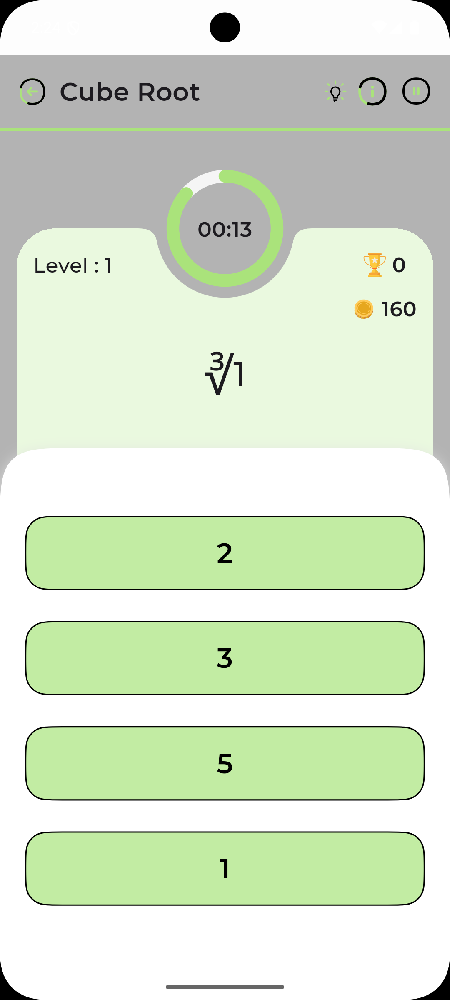
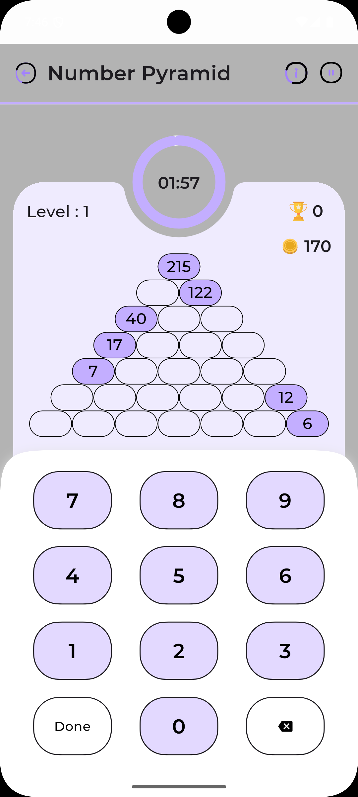

# Memory Math - Educational Math Game

Memory Math is a specially designed educational Flutter application that creates an inclusive learning environment for students with dyslexia and those experiencing early-onset dementia. The app combines evidence-based learning approaches with adaptive technology to make mathematics accessible and enjoyable for all learners.

## Specialized Learning Features

### Accessibility Features

- **Dyslexia Support**
  - OpenDyslexic font option
  - Adjustable text sizing and spacing
  - Color overlay options
  - Text-to-speech functionality
  - Visual pattern recognition tools

- **Cognitive Support**
  - Clear, consistent navigation
  - Step-by-step instructions
  - Regular skill reinforcement
  - Memory-friendly interface
  - Progress tracking for caregivers

### Core Features

- **Multi-language Support**
  - English (Default)
  - Additional languages through localization
  - Easy language switching

- **Theme Support**
  - Light and Dark themes
  - System theme integration
  - Custom color schemes

- **Progress Tracking**
  - Achievement system
  - Progress persistence

- **Audio Feedback**
  - Sound effects for interactions
  - Background music options
  - Mute functionality

## Technical Details

### Key Libraries and Dependencies

### Platform Support

- iOS (12.0+)
- Android (API 21+)
- Windows
- Linux
- macOS

### Architecture

- **Architecture Pattern**: Clean Architecture (see [CLEAN_ARCHITECTURE.md](./CLEAN_ARCHITECTURE.md))
- **State Management**: Provider pattern with ViewModels
- **Dependency Injection**: GetIt service locator
- **Local Storage**: SharedPreferences
- **Design Pattern**: MVVM (Model-View-ViewModel)

> **🎉 New!** The project now includes a complete Clean Architecture implementation alongside the existing code. See [QUICK_START.md](./QUICK_START.md) for getting started with the new architecture.

## Getting Started

### Prerequisites

- Flutter SDK (Latest stable version)
- Dart SDK
- Android Studio / VS Code
- iOS development setup (for iOS builds)

### Installation

1. Clone the repository:

```bash
git clone https://github.com/yourusername/memory_math.git
```

2. Install dependencies:

```bash
flutter pub get
```

3. Run the application:

```bash
flutter run
```

### Building for Production

#### Android

```bash
flutter build apk --release
```

#### iOS

```bash
flutter build ios --release
```

#### Desktop Platforms

```bash
flutter build windows
flutter build linux
flutter build macos
```

## Development

### Project Structure

**Clean Architecture (New)**
```
lib/
├── domain/            # Business logic layer (NEW)
│   ├── entities/      # Business objects
│   ├── repositories/  # Repository interfaces
│   └── usecases/      # Application business rules
├── data/              # Data layer (NEW)
│   ├── datasources/   # Data source implementations
│   └── repositories_impl/ # Repository implementations
├── presentation/      # Presentation layer (NEW)
│   ├── viewmodels/    # State management
│   ├── screens/       # UI screens
│   └── widgets/       # Reusable components
├── core/              # Core utilities (NEW)
│   ├── di/           # Dependency injection
│   └── error/        # Error handling
└── src/              # Existing code (Unchanged)
    ├── core/         # Constants and themes
    ├── data/         # Models and repositories
    ├── ui/           # UI components
    └── utility/      # Helper functions
```

> **📚 Documentation**:
> - [Clean Architecture Guide](./CLEAN_ARCHITECTURE.md) - Complete architecture documentation
> - [Quick Start Guide](./QUICK_START.md) - Get started with examples
> - [Migration Guide](./MIGRATION_GUIDE.md) - Migration strategies
> - [Architecture Summary](./ARCHITECTURE_SUMMARY.md) - Overview and summary

### Contributing

1. Fork the repository
2. Create your feature branch (`git checkout -b feature/AmazingFeature`)
3. Commit your changes (`git commit -m 'Add some AmazingFeature'`)
4. Push to the branch (`git push origin feature/AmazingFeature`)
5. Open a Pull Request


## Acknowledgments

- Flutter team for the amazing framework
- Contributors and maintainers
- Educational mathematics resources and inspiration

## Support

For support, email mule.nikhil@gmail.com or create an issue in the repository.
## Screenshots

| | | |
|:-------------------------:|:-------------------------:|:-------------------------:|
| <br> *Find Missing Numbers*| <br> *Quick Math*| <br> *Math Memory*|
| <br> *Complex Calculations*| <br> *Concentration*| <br> *Feedback Screen*|
| <br> *Cube Root*| <br> *Magic Triangle*| <br> *Math Pairs*|
| <br> *Picture Puzzle*| <br> *Dual Game*| <br> *Math Grid*|
| <br> *Numeric Memory*| <br> *Number Pyramid*| <br> *Magic Triangle*|

## Game Descriptions

### Core Game Modes

1. **Find Missing Numbers**
   - Practice arithmetic with missing numbers
   - Adaptive difficulty levels
   - Visual aids and step-by-step guidance
   - Perfect for building number sense

2. **Quick Math**
   - Fast-paced arithmetic challenges
   - Customizable time limits
   - Multiple operation types (+ - × ÷)
   - Great for mental math practice

3. **Math Memory**
   - Memory-based mathematical challenges
   - Pattern recognition exercises
   - Sequential number recall
   - Builds cognitive and mathematical skills

4. **Complex Calculations**
   - Multi-step mathematical problems
   - Advanced operation combinations
   - Strategic problem-solving focus
   - Suitable for advanced learners

### Additional Game Modes

5. **Concentration**
   - Memory matching with mathematical elements
   - Improves focus and retention
   - Progressive difficulty levels
   - Combines memory and math skills

6. **Magic Triangle**
   - Geometric puzzle solving
   - Number placement challenges
   - Logic and strategy development
   - Visual-spatial reasoning practice

7. **Math Pairs**
   - Match equivalent expressions
   - Various mathematical concepts
   - Time-based challenges
   - Reinforces mathematical relationships

8. **Picture Puzzle**
   - Visual math problems
   - Real-world applications
   - Interactive problem solving
   - Enhances mathematical visualization

9. **Dual Game**
   - Two-player competitive mode
   - Real-time math challenges
   - Social learning opportunities
   - Motivational competitive element

10. **Math Grid**
    - Grid-based number puzzles
    - Pattern completion challenges
    - Spatial reasoning development
    - Multiple difficulty levels

11. **Numeric Memory**
    - Number sequence memorization
    - Working memory enhancement
    - Progressive sequence length
    - Cognitive skill development

12. **Cube Root**
    - Advanced calculation practice
    - Root finding challenges
    - Mathematical estimation skills
    - Higher-order thinking development

Each game mode is designed with:
- Dyslexia-friendly interface options
- Adjustable difficulty settings
- Progress tracking
- Immediate feedback system
- Audio and visual support
- Achievement rewards

## Architecture Details

### Clean Architecture Implementation ✨

The application now features a **complete Clean Architecture implementation** that coexists with the existing code. This provides improved testability, maintainability, and scalability while maintaining 100% backward compatibility.

> **🚀 Quick Links**:
> - [Clean Architecture Guide](./CLEAN_ARCHITECTURE.md) - Complete architecture documentation
> - [Quick Start Guide](./QUICK_START.md) - Get started quickly with examples
> - [Migration Guide](./MIGRATION_GUIDE.md) - How to migrate existing code
> - [Architecture Summary](./ARCHITECTURE_SUMMARY.md) - Overview and metrics

The architecture is organized in layers following the Dependency Rule:

1. **Domain Layer** (`lib/domain/`)
   - Contains business logic and entities
   - Pure Dart code with no dependencies
   - Use cases define application-specific business rules
   - Repository interfaces define data contracts
   - **Example**: `CalculatorEntity`, `GetCalculatorProblemsUseCase`

2. **Data Layer** (`lib/data/`)
   - Implements repository interfaces from Domain layer
   - Handles data sources (local storage, existing repositories)
   - Data mapping and transformation between models and entities
   - Bridges to existing code without modifications
   - **Example**: `CalculatorRepositoryImpl`, `CalculatorDataSource`

3. **Presentation Layer** (`lib/presentation/`)
   - UI components and screens
   - ViewModels handle UI logic and state management
   - State management using Provider and ChangeNotifier
   - Completely testable UI logic
   - **Example**: `CalculatorViewModel`, `ExampleCalculatorScreen`

4. **Core Layer** (`lib/core/`)
   - Shared utilities across all layers
   - Dependency injection setup (GetIt)
   - Error handling (exceptions, failures)
   - App-wide constants and configurations

### Key Benefits

✅ **Zero Breaking Changes**: All existing code (`lib/src/`) remains untouched  
✅ **100% Backward Compatible**: Existing functionality continues to work  
✅ **Improved Testability**: Each layer can be tested independently  
✅ **Better Maintainability**: Clear separation of concerns  
✅ **Enhanced Scalability**: Easy to add new features  
✅ **Framework Independent**: Business logic doesn't depend on Flutter

### Code Organization

```
lib/
├── domain/
│   ├── entities/      # Business objects
│   ├── repositories/  # Repository interfaces
│   └── usecases/      # Business logic
├── data/
│   ├── repositories/  # Repository implementations
│   ├── datasources/   # Data source implementations
│   └── models/        # Data transfer objects
├── presentation/
│   ├── screens/       # UI screens
│   ├── widgets/       # Reusable components
│   └── viewmodels/    # Screen-specific logic
└── core/
    ├── constants/     # App-wide constants
    ├── themes/        # Theme configurations
    └── utils/         # Helper functions
```


**Accessibility Features for Dyslexic Users**

### Visual Design Accommodations

**Text and Typography:**
- **Font Choices:**
  - OpenDyslexic as default font option
  - Comic Sans MS alternative
  - Customizable font size (14pt - 24pt)
  - Adjustable letter spacing (1.35 default)
  - Customizable line height (1.5 default)

- **Color Management:**
  - High contrast color schemes
  - Customizable background colors
  - Pastel color options to reduce visual stress
  - Option to use colored overlays
  - Ability to adjust text-background contrast ratios

**Layout and Organization:**
- **Screen Structure:**
  - Clear visual hierarchy
  - Consistent element positioning
  - Ample white space
  - Limited items per screen
  - Grid-based alignments

- **Navigation:**
  - Clear, icon-based menus
  - Breadcrumb navigation trails
  - Step-by-step progression
  - Visual progress indicators
  - Simplified menu structures


### Personalization Options

**User Profiles:**
- Individual setting preferences
- Progress tracking
- Difficulty level management
- Custom color schemes


**Adaptive Learning:**
- Dynamic difficulty adjustment
- Strength-based progression

### Support Features

**Help System:**
- Context-sensitive help
- Simplified instructions

**Feedback Mechanisms:**
- Immediate response validation
- Positive reinforcement
- Progress celebrations
- Achievement system


## Educational Benefits

### For Dyslexic Learners
- Enhanced number recognition
- Reduced visual stress
- Improved mathematical confidence
- Personalized learning pace
- Multi-sensory engagement

### For Dementia Support
- Cognitive function maintenance
- Memory exercise through repetition
- Social engagement opportunities
- Structured learning routines
- Achievement-based motivation

